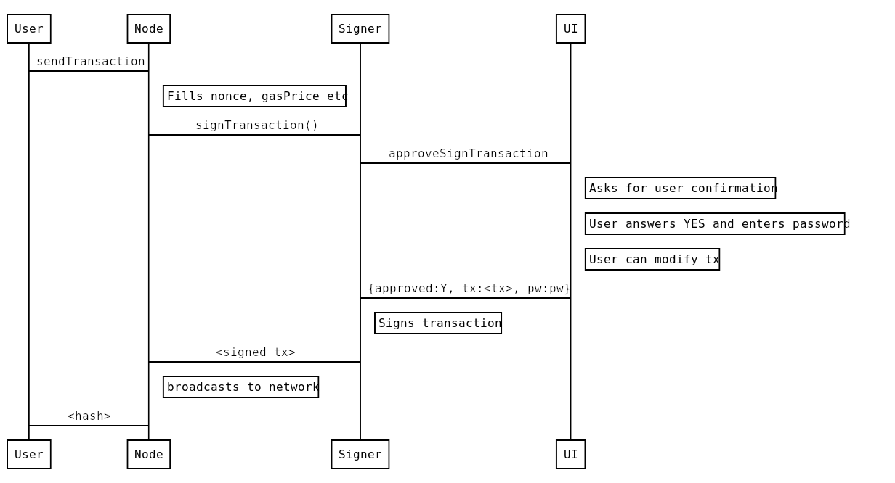

# Clef

Clef can be used to sign transactions and data and is meant as a(n eventual) replacement for Gqrl's account management. This allows DApps to not depend on Gqrl's account management. When a DApp wants to sign data (or a transaction), it can send the content to Clef, which will then provide the user with context and asks for permission to sign the content. If the users grants the signing request, Clef will send the signature back to the DApp.

This setup allows a DApp to connect to a remote QRL node and send transactions that are locally signed. This can help in situations when a DApp is connected to an untrusted remote QRL node, because a local one is not available, not synchronized with the chain, or is a node that has no built-in (or limited) account management.

Clef can run as a daemon on the same machine, off a usb-stick like [USB armory](https://inversepath.com/usbarmory), or even a separate VM in a [QubesOS](https://www.qubes-os.org/) type setup.

Check out the

* [CLI tutorial](tutorial.md) for some concrete examples on how Clef works.
* [Setup docs](docs/setup.md) for information on how to configure Clef on QubesOS or USB Armory.
* [Data types](datatypes.md) for details on the communication messages between Clef and an external UI.

## Command line flags

Clef accepts the following command line options:

```
COMMANDS:
   init    Initialize the signer, generate secret storage
   attest  Attest that a js-file is to be used
   setpw   Store a credential for a keystore file
   delpw   Remove a credential for a keystore file
   gendoc  Generate documentation about json-rpc format
   help    Shows a list of commands or help for one command

GLOBAL OPTIONS:
   --loglevel value        log level to emit to the screen (default: 4)
   --keystore value        Directory for the keystore (default: "$HOME/.qrl/keystore")
   --configdir value       Directory for Clef configuration (default: "$HOME/.clef")
   --chainid value         Chain id to use for signing (1=mainnet) (default: 1)
   --lightkdf              Reduce key-derivation RAM & CPU usage at some expense of KDF strength
   --http.addr value       HTTP-RPC server listening interface (default: "localhost")
   --http.vhosts value     Comma separated list of virtual hostnames from which to accept requests (server enforced). Accepts '*' wildcard. (default: "localhost")
   --ipcdisable            Disable the IPC-RPC server
   --ipcpath               Filename for IPC socket/pipe within the datadir (explicit paths escape it)
   --http                  Enable the HTTP-RPC server
   --http.port value       HTTP-RPC server listening port (default: 8550)
   --signersecret value    A file containing the (encrypted) master seed to encrypt Clef data, e.g. keystore credentials and ruleset hash
   --4bytedb-custom value  File used for writing new 4byte-identifiers submitted via API (default: "./4byte-custom.json")
   --auditlog value        File used to emit audit logs. Set to "" to disable (default: "audit.log")
   --rules value           Path to the rule file to auto-authorize requests with
   --stdio-ui              Use STDIN/STDOUT as a channel for an external UI. This means that an STDIN/STDOUT is used for RPC-communication with a e.g. a graphical user interface, and can be used when Clef is started by an external process.
   --stdio-ui-test         Mechanism to test interface between Clef and UI. Requires 'stdio-ui'.
   --advanced              If enabled, issues warnings instead of rejections for suspicious requests. Default off
   --suppress-bootwarn     If set, does not show the warning during boot
   --help, -h              show help
   --version, -v           print the version
```

Example:

```
$ clef -keystore /my/keystore -chainid 4
```

## Security model

The security model of Clef is as follows:

* One critical component (the Clef binary / daemon) is responsible for handling cryptographic operations: signing, private keys, encryption/decryption of keystore files.
* Clef has a well-defined 'external' API.
* The 'external' API is considered UNTRUSTED.
* Clef also communicates with whatever process that invoked the binary, via stdin/stdout.
  * This channel is considered 'trusted'. Over this channel, approvals and passwords are communicated.

The general flow for signing a transaction using e.g. Gqrl is as follows:


In this case, `gqrl` would be started with `--signer http://localhost:8550` and would relay requests to `qrl.sendTransaction`.

## TODOs

Some snags and todos

* [ ] Clef should take a startup param "--no-change", for UIs that do not contain the capability to perform changes to things, only approve/deny. Such a UI should be able to start the signer in a more secure mode by telling it that it only wants approve/deny capabilities.
* [x] It would be nice if Clef could collect new 4byte-id:s/method selectors, and have a secondary database for those (`4byte_custom.json`). Users could then (optionally) submit their collections for inclusion upstream.
* [ ] It should be possible to configure Clef to check if an account is indeed known to it, before passing on to the UI. The reason it currently does not, is that it would make it possible to enumerate accounts if it immediately returned "unknown account" (side channel attack).
* [x] It should be possible to configure Clef to auto-allow listing (certain) accounts, instead of asking every time.
* [x] Done Upon startup, Clef should spit out some info to the caller (particularly important when executed in `stdio-ui`-mode), invoking methods with the following info:
  * [x] Version info about the signer
  * [x] Address of API (HTTP/IPC)
  * [ ] List of known accounts
* [ ] Have a default timeout on signing operations, so that if the user has not answered within e.g. 60 seconds, the request is rejected.
* [ ] `account_signRawTransaction`
* [ ] `account_bulkSignTransactions([] transactions)` should
   * only exist if enabled via config/flag
   * only allow non-data-sending transactions
   * all txs must use the same `from`-account
   * let the user confirm, showing
      * the total amount
      * the number of unique recipients

* Gqrl todos
    - The signer should pass the `Origin` header as call-info to the UI. As of right now, the way that info about the request is put together is a bit of a hack into the HTTP server. This could probably be greatly improved.
    - Relay: Gqrl should be started in `gqrl --signer localhost:8550`.
    - QRL addresses are 64-byte values rendered as `Q` + 128 QIP-55 mixed-case hex characters. The signer keeps `common.MixedcaseAddress` for API compatibility and uses it to validate checksum casing when the original input is available.
* [x] Storage
    * [x] An encrypted key-value storage should be implemented.
    * See [rules.md](rules.md) for more info about this.
* Another potential thing to introduce is pairing.
  * To prevent spurious requests which users just accept, implement a way to "pair" the caller with the signer (external API).
  * Thus Gqrl/cpp would cryptographically handshake and afterwards the caller would be allowed to make signing requests.
  * This feature would make the addition of rules less dangerous.

* Wallets / accounts. Add API methods for wallets.

## Communication

### External API

Clef listens to HTTP requests on `http.addr`:`http.port` (or to IPC on `ipcpath`), with the same JSON-RPC standard as Gqrl. The messages are expected to be [JSON-RPC 2.0 standard](https://www.jsonrpc.org/specification).

Some of these calls can require user interaction. Clients must be aware that responses may be delayed significantly or may never be received if a user decides to ignore the confirmation request.

The External API is **untrusted**: it does not accept credentials, nor does it expect that requests have any authority.

### Internal UI API

Clef has one native console-based UI, for operation without any standalone tools. However, there is also an API to communicate with an external UI. To enable that UI, the signer needs to be executed with the `--stdio-ui` option, which allocates `stdin` / `stdout` for the UI API.

An example (insecure) proof-of-concept of has been implemented in `pythonsigner.py`.

The model is as follows:

* The user starts the UI app (`pythonsigner.py`).
* The UI app starts `clef` with `--stdio-ui`, and listens to the
process output for confirmation-requests.
* `clef` opens the external HTTP API.
* When the `signer` receives requests, it sends a JSON-RPC request via `stdout`.
* The UI app prompts the user accordingly, and responds to `clef`.
* `clef` signs (or not), and responds to the original request.

## External API

See the [external API changelog](extapi_changelog.md) for information about changes to this API.

### Encoding
- number: positive integers that are hex encoded
- data: hex encoded data
- string: ASCII string

All hex encoded values must be prefixed with `0x`.

### account_new

#### Create new password protected account

The signer will generate a new private key, encrypt it according to [web3 keystore spec](https://github.com/ethereum/wiki/wiki/Web3-Secret-Storage-Definition) and store it in the keystore directory.  
The client is responsible for creating a backup of the keystore. If the keystore is lost there is no method of retrieving lost accounts.

#### Arguments

None

#### Result
  - address [string]: account address that is derived from the generated key

#### Sample call
```json
{
  "id": 0,
  "jsonrpc": "2.0",
  "method": "account_new",
  "params": []
}
```
Response
```json
{
  "id": 0,
  "jsonrpc": "2.0",
  "result": "Q69be3d04d5e9c47341a9cb58f4cba97a7d56aebe57d64d24c687b73c8e9833b4b7485d775f3a50213b7776ea8f7ee75c726497af8de0cb1264b0ee592083b5d1"
}
```

### account_list

#### List available accounts
   List all accounts that this signer currently manages

#### Arguments

None

#### Result
  - array with account records:
     - account.address [string]: account address that is derived from the generated key

#### Sample call
```json
{
  "id": 1,
  "jsonrpc": "2.0",
  "method": "account_list"
}
```
Response
```json
{
  "id": 1,
  "jsonrpc": "2.0",
  "result": [
    "Q33900bb6667e56a86eb4807f006f134c30ab5c65fbecde3993510b9502241e7ac5ac94a9caa36c0ab045b9fb9e560222dbe080094c464c727a10a78f0dcd5bd0",
    "Q69be3d04d5e9c47341a9cb58f4cba97a7d56aebe57d64d24c687b73c8e9833b4b7485d775f3a50213b7776ea8f7ee75c726497af8de0cb1264b0ee592083b5d1"
  ]
}
```

### account_signTransaction

#### Sign transactions
   Signs a transaction and responds with the signed transaction in RLP-encoded and JSON forms.

#### Arguments
  1. transaction object:
     - `from` [address]: account to send the transaction from
     - `to` [address]: receiver account. If omitted or `0x`, will cause contract creation.
     - `gas` [number]: maximum amount of gas to burn
     - `maxFeePerGas` [number]: max fee per gas
     - `maxPriorityFeePerGas` [number]: max priority fee per gas
     - `value` [number:optional]: amount of Planck to send with the transaction
     - `data` [data:optional]:  input data
     - `nonce` [number]: account nonce
  1. method signature [string:optional]
     - The method signature, if present, is to aid decoding the calldata. Should consist of `methodname(paramtype,...)`, e.g. `transfer(uint256,address)`. The signer may use this data to parse the supplied calldata, and show the user. The data, however, is considered totally untrusted, and reliability is not expected.


#### Result
  - raw [data]: signed transaction in RLP encoded form
  - tx [json]: signed transaction in JSON form

#### Sample call
```json
{
  "id": 2,
  "jsonrpc": "2.0",
  "method": "account_signTransaction",
  "params": [
    {
      "from": "Q69be3d04d5e9c47341a9cb58f4cba97a7d56aebe57d64d24c687b73c8e9833b4b7485d775f3a50213b7776ea8f7ee75c726497af8de0cb1264b0ee592083b5d1",
      "gas": "0x55555",
      "maxFeePerGas": "0x1234",
      "maxPriorityFeePerGas": "0x0",
      "nonce": "0x0",
      "to": "Q33900bb6667e56a86eb4807f006f134c30ab5c65fbecde3993510b9502241e7ac5ac94a9caa36c0ab045b9fb9e560222dbe080094c464c727a10a78f0dcd5bd0",
      "value": "0x1234"
    }
  ]
}
```
Response

The exact RLP, public key, signature, and hash depend on the selected signing key. A successful response has this shape:

```json
{
  "jsonrpc": "2.0",
  "id": 2,
  "result": {
    "raw": "0x...",
    "tx": {
      "type": "0x2",
      "chainId": "0x7e7e",
      "nonce": "0x0",
      "to": "Q33900bb6667e56a86eb4807f006f134c30ab5c65fbecde3993510b9502241e7ac5ac94a9caa36c0ab045b9fb9e560222dbe080094c464c727a10a78f0dcd5bd0",
      "gas": "0x55555",
      "value": "0x1234",
      "publicKey": "0x...",
      "signature": "0x...",
      "hash": "0x..."
    }
  }
}
```
#### Sample call with ABI-data


```json
{
  "id": 67,
  "jsonrpc": "2.0",
  "method": "account_signTransaction",
  "params": [
    {
      "from": "Q69be3d04d5e9c47341a9cb58f4cba97a7d56aebe57d64d24c687b73c8e9833b4b7485d775f3a50213b7776ea8f7ee75c726497af8de0cb1264b0ee592083b5d1",
      "gas": "0x333",
      "maxFeePerGas": "0x1",
      "maxPriorityFeePerGas": "0x0",
      "nonce": "0x0",
      "to": "Q33900bb6667e56a86eb4807f006f134c30ab5c65fbecde3993510b9502241e7ac5ac94a9caa36c0ab045b9fb9e560222dbe080094c464c727a10a78f0dcd5bd0",
      "value": "0x0",
      "data": "0x4401a6e433900bb6667e56a86eb4807f006f134c30ab5c65fbecde3993510b9502241e7ac5ac94a9caa36c0ab045b9fb9e560222dbe080094c464c727a10a78f0dcd5bd0"
    },
    "safeSend(address)"
  ]
}
```
Response

The response uses the same key-dependent shape shown above.

### account_signData

#### Sign data
   Signs a chunk of data and returns the calculated signature.

#### Arguments
  - content type [string]: type of signed data
     - `text/validator`: hex data with custom validator defined in a contract
     - `text/plain`: simple hex data
  - account [address]: account to sign with
  - data [object]: data to sign

#### Result
  - calculated signature [data]

#### Sample call
```json
{
  "id": 3,
  "jsonrpc": "2.0",
  "method": "account_signData",
  "params": [
    "data/plain",
    "Q69be3d04d5e9c47341a9cb58f4cba97a7d56aebe57d64d24c687b73c8e9833b4b7485d775f3a50213b7776ea8f7ee75c726497af8de0cb1264b0ee592083b5d1",
    "0xaabbccdd"
  ]
}
```
Response

The returned ML-DSA-87 signature depends on the selected account:

```json
{
  "jsonrpc": "2.0",
  "id": 3,
  "result": "0x..."
}
```

### account_signTypedData

#### Sign data
   Signs QRL typed structured data and returns the calculated signature.

#### Arguments
  - account [address]: account to sign with
  - data [object]: data to sign

#### Result
  - calculated signature [data]

#### Sample call
```json
{
  "id": 68,
  "jsonrpc": "2.0",
  "method": "account_signTypedData",
  "params": [
    "Q00000000000000000000000000000000000000000000000000000000000000000000000000000000000000000011223344556677889900112233445566778899",
    {
      "types": {
        "QRLTypedDataDomain": [
          {
            "name": "name",
            "type": "string"
          },
          {
            "name": "version",
            "type": "string"
          },
          {
            "name": "chainId",
            "type": "uint256"
          },
          {
            "name": "verifyingContract",
            "type": "address"
          }
        ],
        "Person": [
          {
            "name": "name",
            "type": "string"
          },
          {
            "name": "wallet",
            "type": "address"
          }
        ],
        "Mail": [
          {
            "name": "from",
            "type": "Person"
          },
          {
            "name": "to",
            "type": "Person"
          },
          {
            "name": "contents",
            "type": "string"
          }
        ]
      },
      "primaryType": "Mail",
      "domain": {
        "name": "Ether Mail",
        "version": "1",
        "chainId": 1,
        "verifyingContract": "QCCCcCCCcCCCcCCCcCCCcCCCcCCCcCCCcCCCcCCCcCCCcCCCcCCCcCCCcCCCcCCCcCCCcCCCcCCCcCCCcCCCcCCCcCCCcCCCc99aabbccddeeff001122334455667788"
      },
      "message": {
        "from": {
          "name": "Cow",
          "wallet": "QcD2a3d9F938E13CD947Ec05AbC7FE734Df8DD826cD2a3d9F938E13CD947Ec05AbC7FE734Df8DD826aabbccddeeff010299aabbccddeeff001122334455667788"
        },
        "to": {
          "name": "Bob",
          "wallet": "QbBbBBBBbbBBBbbbBbbBbbbbBBbBbbbbBbBbbBBbBbBbBBBBbbBBBbbbBbbBbbbbBBbBbbbbBbBbbBBbBaabbccddee01020399aabbccddeeff001122334455667788"
        },
        "contents": "Hello, Bob!"
      }
    }
  ]
}
```

Response

The signature is abbreviated below. Clef uses hedged ML-DSA-87 signing, so the signature bytes differ between valid calls.

```json
{
  "jsonrpc": "2.0",
  "id": 68,
  "result": "0x..."
}
```

### account_version

#### Get external API version

Get the version of the external API used by Clef.

#### Arguments

None

#### Result

* external API version [string]

#### Sample call
```json
{
  "id": 0,
  "jsonrpc": "2.0",
  "method": "account_version",
  "params": []
}
```

Response
```json
{
    "jsonrpc": "2.0",
    "id": 0,
    "result": "6.1.0"
}
```

## UI API

These methods needs to be implemented by a UI listener.

By starting the signer with the switch `--stdio-ui-test`, the signer will invoke all known methods, and expect the UI to respond with
denials. This can be used during development to ensure that the API is (at least somewhat) correctly implemented.
See `pythonsigner`, which can be invoked via `python3 pythonsigner.py test` to perform the 'denial-handshake-test'.

All methods in this API use object-based parameters, so that there can be no mixup of parameters: each piece of data is accessed by key.

See the [ui API changelog](intapi_changelog.md) for information about changes to this API.

OBS! A slight deviation from `json` standard is in place: every request and response should be confined to a single line.
Whereas the `json` specification allows for linebreaks, linebreaks __should not__ be used in this communication channel, to make
things simpler for both parties.

### ApproveTx / `ui_approveTx`

Invoked when there's a transaction for approval.


#### Sample call

Here's a method invocation:
```bash

curl -i -H "Content-Type: application/json" -X POST --data '{"jsonrpc":"2.0","method":"account_signTransaction","params":[{"from":"Q69be3d04d5e9c47341a9cb58f4cba97a7d56aebe57d64d24c687b73c8e9833b4b7485d775f3a50213b7776ea8f7ee75c726497af8de0cb1264b0ee592083b5d1","gas":"0x333","maxFeePerGas":"0x1","maxPriorityFeePerGas":"0x1","nonce":"0x0","to":"Q33900bb6667e56a86eb4807f006f134c30ab5c65fbecde3993510b9502241e7ac5ac94a9caa36c0ab045b9fb9e560222dbe080094c464c727a10a78f0dcd5bd0", "value":"0x0", "data":"0x4401a6e433900bb6667e56a86eb4807f006f134c30ab5c65fbecde3993510b9502241e7ac5ac94a9caa36c0ab045b9fb9e560222dbe080094c464c727a10a78f0dcd5bd0"},"safeSend(address)"],"id":67}' http://localhost:8550/
```
Results in the following invocation on the UI:
```json

{
  "jsonrpc": "2.0",
  "id": 1,
  "method": "ui_approveTx",
  "params": [
    {
      "transaction": {
        "from": "Q69be3d04d5e9c47341a9cb58f4cba97a7d56aebe57d64d24c687b73c8e9833b4b7485d775f3a50213b7776ea8f7ee75c726497af8de0cb1264b0ee592083b5d1",
        "to": "Q33900bb6667e56a86eb4807f006f134c30ab5c65fbecde3993510b9502241e7ac5ac94a9caa36c0ab045b9fb9e560222dbe080094c464c727a10a78f0dcd5bd0",
        "gas": "0x333",
        "maxFeePerGas": "0x1",
        "maxPriorityFeePerGas": "0x1",
        "value": "0x0",
        "nonce": "0x0",
        "data": "0x4401a6e433900bb6667e56a86eb4807f006f134c30ab5c65fbecde3993510b9502241e7ac5ac94a9caa36c0ab045b9fb9e560222dbe080094c464c727a10a78f0dcd5bd0",
        "input": null
      },
      "call_info": [
          {
            "type": "Info",
            "message": "safeSend(address: Q33900bb6667e56a86eb4807f006f134c30ab5c65fbecde3993510b9502241e7ac5ac94a9caa36c0ab045b9fb9e560222dbe080094c464c727a10a78f0dcd5bd0)"
          }
        ],
      "meta": {
        "remote": "127.0.0.1:48486",
        "local": "localhost:8550",
        "scheme": "HTTP/1.1"
      }
    }
  ]
}

```

The same method invocation, but with invalid data:
```bash

curl -i -H "Content-Type: application/json" -X POST --data '{"jsonrpc":"2.0","method":"account_signTransaction","params":[{"from":"Q69be3d04d5e9c47341a9cb58f4cba97a7d56aebe57d64d24c687b73c8e9833b4b7485d775f3a50213b7776ea8f7ee75c726497af8de0cb1264b0ee592083b5d1","gas":"0x333","maxFeePerGas":"0x1","maxPriorityFeePerGas":"0x1","nonce":"0x0","to":"Q33900bb6667e56a86eb4807f006f134c30ab5c65fbecde3993510b9502241e7ac5ac94a9caa36c0ab045b9fb9e560222dbe080094c464c727a10a78f0dcd5bd0", "value":"0x0", "data":"0x4401a6e433900bb6667e56a86eb4807f006f134c30ab5c65fbecde3993510b9502241e7ac5ac94a9caa36c0ab045b9fb9e560222dbe080094c464c727a10a78f0dcd5bd000"},"safeSend(address)"],"id":67}' http://localhost:8550/
```

```json

{
  "jsonrpc": "2.0",
  "id": 1,
  "method": "ui_approveTx",
  "params": [
    {
      "transaction": {
        "from": "Q69be3d04d5e9c47341a9cb58f4cba97a7d56aebe57d64d24c687b73c8e9833b4b7485d775f3a50213b7776ea8f7ee75c726497af8de0cb1264b0ee592083b5d1",
        "to": "Q33900bb6667e56a86eb4807f006f134c30ab5c65fbecde3993510b9502241e7ac5ac94a9caa36c0ab045b9fb9e560222dbe080094c464c727a10a78f0dcd5bd0",
        "gas": "0x333",
        "maxFeePerGas": "0x1",
        "maxPriorityFeePerGas": "0x1",
        "value": "0x0",
        "nonce": "0x0",
        "data": "0x4401a6e433900bb6667e56a86eb4807f006f134c30ab5c65fbecde3993510b9502241e7ac5ac94a9caa36c0ab045b9fb9e560222dbe080094c464c727a10a78f0dcd5bd000",
        "input": null
      },
      "call_info": [
          {
            "type": "WARNING",
            "message": "Transaction data did not match ABI interface: supplied data contains one extra byte."
          }
        ],
      "meta": {
        "remote": "127.0.0.1:48492",
        "local": "localhost:8550",
        "scheme": "HTTP/1.1"
      }
    }
  ]
}


```

One which has missing `to`, but with no `data`:


```json

{
  "jsonrpc": "2.0",
  "id": 3,
  "method": "ui_approveTx",
  "params": [
    {
      "transaction": {
        "from": "",
        "to": null,
        "gas": "0x0",
        "maxFeePerGas": "0x0",
        "maxPriorityFeePerGas": "0x0",
        "value": "0x0",
        "nonce": "0x0",
        "data": null,
        "input": null
      },
      "call_info": [
          {
            "type": "CRITICAL",
            "message": "Tx will create contract with empty code!"
          }
        ],
      "meta": {
        "remote": "signer binary",
        "local": "main",
        "scheme": "in-proc"
      }
    }
  ]
}
```

### ApproveListing / `ui_approveListing`

Invoked when a request for account listing has been made.

#### Sample call

```json

{
  "jsonrpc": "2.0",
  "id": 5,
  "method": "ui_approveListing",
  "params": [
    {
      "accounts": [
        {
          "url": "keystore:///home/bazonk/.qrl/keystore/UTC--2017-11-20T14-44-54.089682944Z--Q69be3d04d5e9c47341a9cb58f4cba97a7d56aebe57d64d24c687b73c8e9833b4b7485d775f3a50213b7776ea8f7ee75c726497af8de0cb1264b0ee592083b5d1",
          "address": "Q69be3d04d5e9c47341a9cb58f4cba97a7d56aebe57d64d24c687b73c8e9833b4b7485d775f3a50213b7776ea8f7ee75c726497af8de0cb1264b0ee592083b5d1"
        },
        {
          "url": "keystore:///home/bazonk/.qrl/keystore/UTC--2017-11-23T21-59-03.199240693Z--Q33900bb6667e56a86eb4807f006f134c30ab5c65fbecde3993510b9502241e7ac5ac94a9caa36c0ab045b9fb9e560222dbe080094c464c727a10a78f0dcd5bd0",
          "address": "Q33900bb6667e56a86eb4807f006f134c30ab5c65fbecde3993510b9502241e7ac5ac94a9caa36c0ab045b9fb9e560222dbe080094c464c727a10a78f0dcd5bd0"
        }
      ],
      "meta": {
        "remote": "signer binary",
        "local": "main",
        "scheme": "in-proc"
      }
    }
  ]
}

```


### ApproveSignData / `ui_approveSignData`

#### Sample call

```json
{
  "jsonrpc": "2.0",
  "id": 4,
  "method": "ui_approveSignData",
  "params": [
    {
      "address": "Q69be3d04d5e9c47341a9cb58f4cba97a7d56aebe57d64d24c687b73c8e9833b4b7485d775f3a50213b7776ea8f7ee75c726497af8de0cb1264b0ee592083b5d1",
      "raw_data": "0x01020304",
      "messages": [
        {
          "name": "message",
          "value": "\u0019QRL Signed Message:\n4\u0001\u0002\u0003\u0004",
          "type": "text/plain"
        }
      ],
      "hash": "0x7e3a4e7a9d1744bc5c675c25e1234ca8ed9162bd17f78b9085e48047c15ac310",
      "meta": {
        "remote": "signer binary",
        "local": "main",
        "scheme": "in-proc"
      }
    }
  ]
}
```

### ApproveNewAccount / `ui_approveNewAccount`

Invoked when a request for creating a new account has been made.

#### Sample call

```json
{
  "jsonrpc": "2.0",
  "id": 4,
  "method": "ui_approveNewAccount",
  "params": [
    {
      "meta": {
        "remote": "signer binary",
        "local": "main",
        "scheme": "in-proc"
      }
    }
  ]
}
```

### ShowInfo / `ui_showInfo`

The UI should show the info (a single message) to the user. Does not expect response.

#### Sample call

```json
{
  "jsonrpc": "2.0",
  "id": 9,
  "method": "ui_showInfo",
  "params": [
    "Tests completed"
  ]
}

```

### ShowError / `ui_showError`

The UI should show the error (a single message) to the user. Does not expect response.

```json

{
  "jsonrpc": "2.0",
  "id": 2,
  "method": "ui_showError",
  "params": [
    "Something bad happened!"
  ]
}

```

### OnApprovedTx / `ui_onApprovedTx`

`OnApprovedTx` is called when a transaction has been approved and signed. The call contains the return value that will be sent to the external caller.  The return value from this method is ignored - the reason for having this callback is to allow the ruleset to keep track of approved transactions.

When implementing rate-limited rules, this callback should be used.

TLDR; Use this method to keep track of signed transactions, instead of using the data in `ApproveTx`.

Example payloads are generated by `clef gendoc`; see [OnApproved - SignTransactionResult](datatypes.md#onapproved---signtransactionresult).

### OnSignerStartup / `ui_onSignerStartup`

This method provides the UI with information about what API version the signer uses (both internal and external) as well as build-info and external API,
in k/v-form.

Example call:
```json

{
  "jsonrpc": "2.0",
  "id": 1,
  "method": "ui_onSignerStartup",
  "params": [
    {
      "info": {
        "extapi_http": "http://localhost:8550",
        "extapi_ipc": null,
        "extapi_version": "2.0.0",
        "intapi_version": "1.2.0"
      }
    }
  ]
}

```

### OnInputRequired / `ui_onInputRequired`

Invoked when Clef requires user input (e.g. a password).

Example call:
```json

{
  "jsonrpc": "2.0",
  "id": 1,
  "method": "ui_onInputRequired",
  "params": [
    {
      "title": "Account password",
      "prompt": "Please enter the password for account Q69be3d04d5e9c47341a9cb58f4cba97a7d56aebe57d64d24c687b73c8e9833b4b7485d775f3a50213b7776ea8f7ee75c726497af8de0cb1264b0ee592083b5d1",
      "isPassword": true
    }
  ]
}
```


### Rules for UI apis

A UI should conform to the following rules.

* A UI MUST NOT load any external resources that were not embedded/part of the UI package.
  * For example, not load icons, stylesheets from the internet
  * Not load files from the filesystem, unless they reside in the same local directory (e.g. config files)
* A Graphical UI MUST show the blocky-identicon for qrl addresses.
* A UI MUST validate that the destination account is a structurally valid QRL address.
* A UI MUST NOT open any ports or services
  * The signer opens the public port
* A UI SHOULD verify the permissions on the signer binary, and refuse to execute or warn if permissions allow non-user write.
* A UI SHOULD inform the user about the `SHA256` or `MD5` hash of the binary being executed
* A UI SHOULD NOT maintain a secondary storage of data, e.g. list of accounts
  * The signer provides accounts
* A UI SHOULD, to the best extent possible, use static linking / bundling, so that required libraries are bundled
along with the UI.


### UI Implementations

There are a couple of implementation for a UI. We'll try to keep this list up to date.

| Name | Repo | UI type| No external resources| Blocky support| Verifies permissions | Hash information | No secondary storage | Statically linked| Can modify parameters|
| ---- | ---- | -------| ---- | ---- | ---- |---- | ---- | ---- | ---- |
| QtSigner| https://github.com/holiman/qtsigner/ | Python3/QT-based| :+1:| :+1:| :+1:| :+1:| :+1:| :x: |  :+1: (partially)|
| GtkSigner| https://github.com/holiman/gtksigner | Python3/GTK-based| :+1:| :x:| :x:| :+1:| :+1:| :x: |  :x: |
| Frame | https://github.com/floating/frame/commits/go-signer | Electron-based| :x:| :x:| :x:| :x:| ?| :x: |  :x: |
| Clef UI| https://github.com/ethereum/clef-ui | Golang/QT-based| :+1:| :+1:| :x:| :+1:| :+1:| :x: |  :+1: (approve tx only)|
